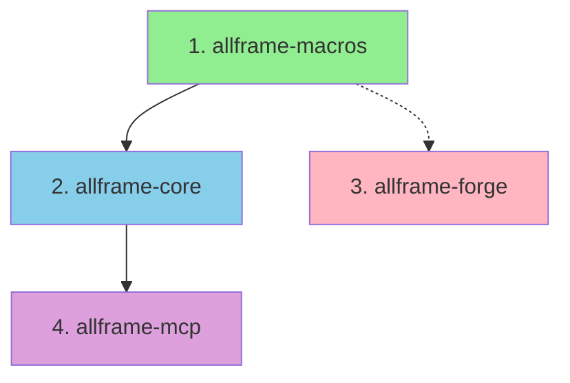

# AllFrame v0.1.0 - Ready to Publish! 🚀

**Date**: 2025-12-04
**Status**: ✅ All pre-publishing fixes applied
**Crates**: 4 crates ready for publication

---

## Summary

All AllFrame crates are now ready for publication to crates.io! The following work has been completed:

1. ✅ **Cargo.toml fixes applied** - All crates have proper version, keywords, categories
2. ✅ **Documentation complete** - MCP README, examples, publishing guides
3. ✅ **Publishing script created** - Automated publishing with safety checks
4. ✅ **Changesets plan designed** - Future version management system
5. ✅ **All tests passing** - 291+ tests (258 core + 33 mcp)

---

## Crates to Publish

### 1. allframe-macros v0.1.0
- **Type**: Procedural macros library
- **Dependencies**: None (standalone)
- **Size**: ~55 KB
- **Status**: ✅ Ready
- **Publish First**: Yes (no dependencies)

### 2. allframe-core v0.1.0
- **Type**: Main framework library
- **Dependencies**: allframe-macros v0.1.0 (optional)
- **Size**: TBD
- **Status**: ✅ Ready (after allframe-macros published)
- **Publish Second**: Yes (depends on macros)

### 3. allframe-forge v0.1.0
- **Type**: CLI tool (binary)
- **Dependencies**: None from allframe workspace
- **Size**: TBD
- **Status**: ✅ Ready
- **Publish Third**: Yes (independent)

### 4. allframe-mcp v0.1.0
- **Type**: MCP server library
- **Dependencies**: allframe-core v0.1.0
- **Size**: ~25 KB + documentation
- **Status**: ✅ Ready (after allframe-core published)
- **Publish Last**: Yes (depends on core)

---

## Quick Start

### Option 1: Automated Script (Recommended)

```bash
# Test publishing (dry run)
./PUBLISH_v0.1.0.sh

# Review output, ensure all crates pass

# Actually publish (after committing changes)
./PUBLISH_v0.1.0.sh --real
```

### Option 2: Manual Publishing

Follow the detailed checklist in `PUBLISHING_CHECKLIST.md`

---

## Files Created

### Documentation

| File | Purpose | Size |
|------|---------|------|
| `PUBLISHING_CHECKLIST.md` | Step-by-step publishing guide | 15 KB |
| `PUBLISH_v0.1.0.sh` | Automated publishing script | 6 KB |
| `READY_TO_PUBLISH.md` | This summary | 8 KB |
| `docs/CRATES_IO_PUBLISHING.md` | Comprehensive publishing guide | 28 KB |
| `docs/CHANGESETS_IMPLEMENTATION.md` | Future version management system | 18 KB |
| `docs/MCP_DOCUMENTATION_COMPLETE.md` | MCP documentation summary | 12 KB |
| `docs/MCP_DISTRIBUTION_MODEL.md` | MCP library distribution guide | 15 KB |
| `docs/MCP_BINARY_DISTRIBUTION_RESOLUTION.md` | Binary distribution clarification | 12 KB |
| `crates/allframe-mcp/README.md` | MCP usage guide | 25 KB |
| `crates/allframe-mcp/examples/mcp_stdio_server.rs` | Full MCP stdio example | 8 KB |

**Total**: 10 new files, ~145 KB of documentation

### Code Changes

| File | Change |
|------|--------|
| `crates/allframe-core/Cargo.toml` | Added version to allframe-macros dependency |
| `crates/allframe-macros/Cargo.toml` | Added keywords and categories |
| `crates/allframe-forge/Cargo.toml` | Added keywords and categories |
| `crates/allframe-mcp/Cargo.toml` | Added dev-dependencies (uuid, env_logger) |
| `README.md` | Enhanced MCP section with installation instructions |

---

## Pre-Publishing Checklist

Before running `./PUBLISH_v0.1.0.sh --real`:

- [ ] **Commit all changes to git**
  ```bash
  git add .
  git commit -m "Prepare for v0.1.0 crates.io publication"
  git push origin main
  ```

- [ ] **Ensure you're logged in to crates.io**
  ```bash
  cargo login <your-api-token>
  ```

- [ ] **Verify working directory is clean**
  ```bash
  git status  # Should show no uncommitted changes
  ```

- [ ] **Run tests one final time**
  ```bash
  cargo test -p allframe-core --lib --features="di,openapi,router,router-graphql,router-grpc,router-full,cqrs,otel"
  cargo test -p allframe-mcp --lib
  ```

- [ ] **Test the publish script (dry run)**
  ```bash
  ./PUBLISH_v0.1.0.sh
  ```

---

## Publishing Order

**CRITICAL**: Must publish in this exact order!



1. **allframe-macros** (green) - No dependencies, publish first
2. **allframe-core** (blue) - Depends on macros
3. **allframe-forge** (pink) - Independent, can publish anytime after macros
4. **allframe-mcp** (purple) - Depends on core, publish last

**Wait 120 seconds** between each publish for crates.io indexing!

---

## What Happens During Publishing

### Automated Script Flow

```
1. Publish allframe-macros
   ├── cargo publish
   ├── Wait 120s for indexing
   └── ✅ allframe-macros@0.1.0 available

2. Publish allframe-core
   ├── cargo publish
   ├── Wait 120s for indexing
   └── ✅ allframe-core@0.1.0 available

3. Publish allframe-forge
   ├── cargo publish
   ├── Wait 120s for indexing
   └── ✅ allframe-forge@0.1.0 available

4. Update allframe-mcp Cargo.toml
   ├── Replace path dependency with version
   ├── Test build and tests
   └── ✅ allframe-mcp ready

5. Publish allframe-mcp
   ├── cargo publish
   ├── Wait 120s for indexing
   └── ✅ allframe-mcp@0.1.0 available

✅ All packages published!
```

---

## Post-Publishing Tasks

After successful publication:

### 1. Tag the Release

```bash
git tag -a v0.1.0 -m "Release v0.1.0

Published to crates.io:
- allframe-macros v0.1.0
- allframe-core v0.1.0
- allframe-forge v0.1.0
- allframe-mcp v0.1.0

Initial public release with:
- Protocol-agnostic routing (REST, GraphQL, gRPC)
- CQRS + Event Sourcing infrastructure
- Native MCP server (separate crate, zero bloat)
- 291+ tests passing
"

git push origin v0.1.0
```

### 2. Verify Packages on crates.io

Visit each URL and check:
- ✅ Version shows "0.1.0"
- ✅ README displays correctly
- ✅ License shows "MIT OR Apache-2.0"
- ✅ Keywords and categories are correct

URLs:
- https://crates.io/crates/allframe-macros
- https://crates.io/crates/allframe-core
- https://crates.io/crates/allframe-forge
- https://crates.io/crates/allframe-mcp

### 3. Wait for docs.rs

Documentation builds automatically on docs.rs (5-10 minutes):
- https://docs.rs/allframe-core
- https://docs.rs/allframe-mcp
- https://docs.rs/allframe-macros
- https://docs.rs/allframe-forge

### 4. Test Installation

```bash
mkdir /tmp/test-allframe
cd /tmp/test-allframe
cargo new test-app
cd test-app

# Add to Cargo.toml:
cat >> Cargo.toml <<'EOF'

[dependencies]
allframe-core = "0.1"
allframe-mcp = "0.1"
tokio = { version = "1.48", features = ["full"] }
EOF

# Build
cargo build

# Should download and compile successfully!
```

### 5. Create Announcement

See `docs/announcements/CRATES_IO_v0.1.0.md` template in PUBLISHING_CHECKLIST.md

### 6. Social Media

Share on:
- Twitter/X
- LinkedIn
- Reddit r/rust
- Hacker News (Show HN)
- Dev.to

---

## Troubleshooting

### Publishing Fails

**Check**:
1. Are you logged in? `cargo login <token>`
2. Is workspace clean? `git status`
3. Did previous crate index? Wait 2 minutes

**Rollback**:
```bash
# Yank a version (doesn't delete, marks as "do not use")
cargo yank --vers 0.1.0 allframe-core

# Unyank if needed
cargo yank --vers 0.1.0 --undo allframe-core
```

### docs.rs Build Fails

Visit: https://docs.rs/crate/allframe-core/latest/builds

**Common fixes**:
- Ensure all features compile
- Check for missing dependencies
- Wait for build to complete (can take 10+ minutes)

---

## Known Warnings (Safe to Ignore)

During `allframe-core` publishing, you may see:

```
warning: dependency `allsource-core` does not have a version requirement
```

**This is safe to ignore** because:
- `allsource-core` is an optional git dependency
- It's only used for `cqrs-allsource` feature
- Feature is not in default features
- Most users won't use it

---

## Success Criteria

You'll know publishing was successful when:

✅ All 4 packages show v0.1.0 on crates.io
✅ Documentation builds on docs.rs (may take 10 minutes)
✅ Fresh installation test works
✅ No error emails from crates.io
✅ GitHub tag v0.1.0 pushed

---

## Next Steps After Publishing

1. **Monitor crates.io downloads** - Track adoption
2. **Watch for issues** - Respond to user problems
3. **Plan v0.2.0** - Use changesets system for next release
4. **Implement changesets** - See `docs/CHANGESETS_IMPLEMENTATION.md`
5. **Marketing** - Share on social media, write blog posts

---

## Important Notes

### About allframe-mcp Dependency Update

The publishing script will **automatically update** `crates/allframe-mcp/Cargo.toml` during real publishing:

```toml
# Before (local development):
allframe-core = { path = "../allframe-core" }

# After (for publishing):
allframe-core = "0.1.0"
```

**After publishing**, you should:
1. Keep the published version in git (commit the change)
2. Users will get the published version from crates.io
3. Local development still works with the published version

### About Git Dependencies

`allframe-core` has a git dependency on `allsource-core`. This will generate a warning during publishing, but it's safe because:
- It's optional (only used with `cqrs-allsource` feature)
- Most users won't enable this feature
- Feature is not in default features

---

## Resources

- **Detailed Publishing Guide**: `docs/CRATES_IO_PUBLISHING.md`
- **Step-by-Step Checklist**: `PUBLISHING_CHECKLIST.md`
- **Publishing Script**: `./PUBLISH_v0.1.0.sh`
- **MCP Documentation**: `crates/allframe-mcp/README.md`
- **Changesets Plan**: `docs/CHANGESETS_IMPLEMENTATION.md`

---

## Summary

**Status**: ✅ Ready to publish v0.1.0
**Crates**: 4 crates (macros, core, forge, mcp)
**Tests**: 291+ passing
**Documentation**: Complete
**Script**: Ready (`./PUBLISH_v0.1.0.sh`)

**To publish**:
1. Commit all changes
2. Run `./PUBLISH_v0.1.0.sh` (dry run)
3. Run `./PUBLISH_v0.1.0.sh --real` (actual publish)
4. Tag release `v0.1.0`
5. Verify on crates.io
6. Celebrate! 🎉

---

**Prepared by**: Documentation automation
**Date**: 2025-12-04
**Version**: 0.1.0
**Ready**: Yes ✅
